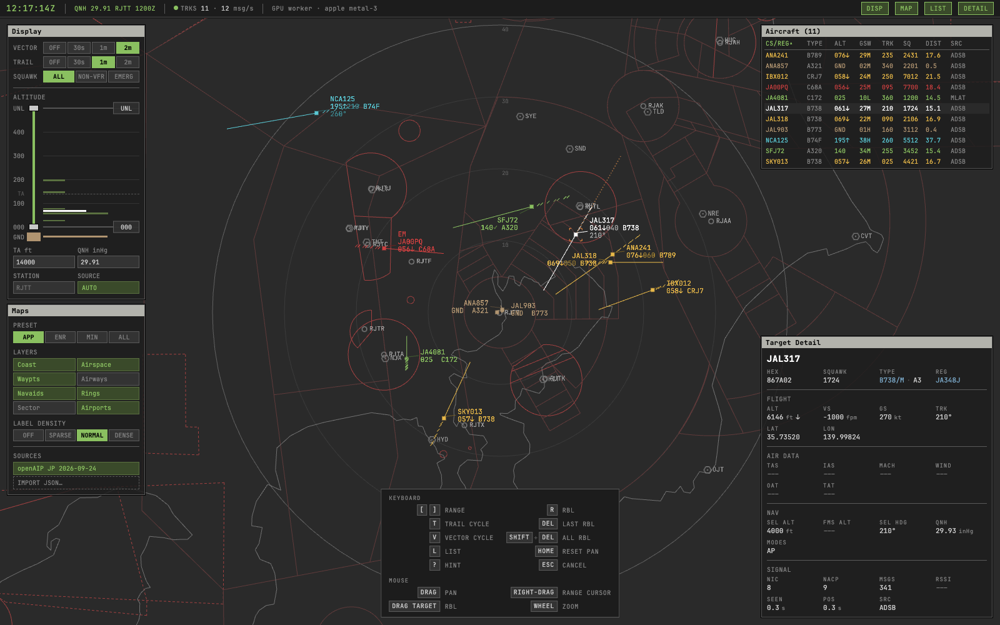
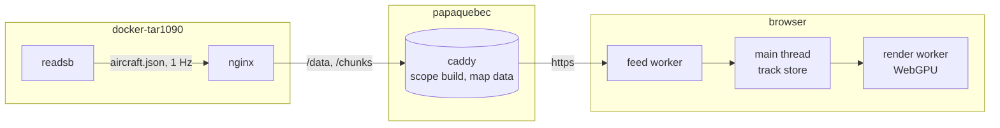

# papaquebec

A passive ADS-B scope in the visual vocabulary of a radar display rather than a map: position
symbols, data blocks and trails on a dark screen. It is served beside
[`docker-tar1090`](https://github.com/sdr-enthusiasts/docker-tar1090) in place of its web UI, with
no backend of its own: [`readsb`](https://github.com/wiedehopf/readsb) decodes and publishes, the
scope draws.



## Deployment

The scope runs in its own container beside `docker-tar1090`: a [Caddy](https://caddyserver.com) that
serves the build over https (browsers expose WebGPU only in secure contexts, which the tar1090 image
cannot provide) and proxies the two data paths to [tar1090](https://github.com/wiedehopf/tar1090),
which stays stock on port 80. At start the container asks tar1090 for the receiver position and
generates the map data around it, so nothing needs configuring beyond the compose entry.

1. Clone this repository on the machine that runs tar1090.
2. Add the service to the compose file that runs tar1090, then `docker compose up -d --build`:

```yaml
services:
  tar1090:
    environment:
      - TAR1090_ENABLE_AC_DB=true # type and registration in aircraft.json
  papaquebec:
    build: /path/to/papaquebec
    restart: unless-stopped
    ports:
      - 443:443
      - 443:443/udp # HTTP/3
    volumes:
      - caddy_data:/data # the certificate authority
      - map_data:/app/public/map
    depends_on:
      - tar1090
volumes:
  caddy_data:
  map_data:
```

3. Open `https://<host>/` on the machine's name (Raspberry Pi OS announces `<hostname>.local`).
   Caddy signs a certificate for whatever name is asked for with its own local authority, so the
   browser objects until that authority is trusted once per device: download `https://<host>/root.crt`
   and add it to the system trust (Settings > General > VPN & Device Management, then Certificate
   Trust Settings on iOS; Keychain Access on macOS; `certutil`/`update-ca-certificates` elsewhere).

Environment on the service, all optional:

- `PQ_TAR1090` (default `http://tar1090`): the tar1090 service, if it is named differently.
- `PQ_SITE` (`lat,lon`): the map center, when readsb is not told its position.
- `PQ_ADDRESS` (default `https://`): the Caddy site address. A host name or IP pins the certificate
  to it; `http://` serves plain http on port 80 for a setup that terminates TLS itself, such as
  [Tailscale](https://tailscale.com) or an existing reverse proxy (then publish `80`, not `443`).

Ports can be remapped (`8443:443`) when 443 is taken. An update is `git pull` and `up -d --build`
again; a restart refreshes the aeronautical data. Optionally, `READSB_ENABLE_TRACES=true` on
tar1090 with a `/var/globe_history` volume lets the selected target show its whole day instead of
the last ten minutes.

## Development

`mise install` pins Bun. The dev and preview servers proxy `/data` and `/chunks` to a tar1090,
or to the synthetic fleet served by `bun run sim`, a stand-in tar1090 on port 8090:

```sh
cd scope
export PQ_TAR1090=http://<host>     # or http://localhost:8090 with `bun run sim`
bun run map            # map data around the receiver, see below
bun run dev
```

Query parameters: `?site=<lat>,<lon>` overrides the receiver position, `?wx=<base>` reads METARs
from your own [Aviation Weather Center](https://aviationweather.gov) proxy.

Checks: `bun test`, `bun run lint`, `bun run format:check`, `bun run build`.
GitHub Actions runs the same four and builds the image on every push and pull request.
`bun scripts/screenshot.ts` drives a build in headless Chromium with WebGPU and saves a frame plus
the console log; `bun run screenshot` regenerates the README picture from the synthetic fleet. The
sim and screenshot scripts describe their flags in their headers.

## Altimeter

The QNH follows the METAR of the station named on the Display panel (blank means the nearest airport
with a report), re-read periodically and shown in the top bar with the observation time. Typing
a QNH switches to manual until AUTO is turned back on. Reports come from the [Iowa Environmental
Mesonet](https://mesonet.agron.iastate.edu), which relays NOAA's worldwide METAR feed with browser
access allowed; NOAA's own Aviation Weather Center does not, hence the `?wx=` proxy option.

## Map data

`bun run map` (the container runs it at every start) writes two git-ignored files:

- `public/map/coast.json`: [Natural Earth](https://www.naturalearthdata.com) 10 m coastline (public
  domain) within 300 NM of the site; skipped while the file already covers the same site.
- `public/map/aero.json`: airspace, navaids, airports and reporting points within 150 NM from
  [openAIP](https://www.openaip.net)'s daily exports (anonymous download, CC BY-NC-SA 4.0), for
  every country in range. The Maps panel shows the fetch date; when the exports cannot be reached
  the previous file is kept.

The site comes from `PQ_SITE` (`lat,lon`) or the tar1090 at `PQ_TAR1090`; pass `<lat> <lon>` and
optionally a radius to either script to override it.

openAIP carries no IFR waypoints or airways, so those layers stay empty. Any other source can be
brought in through the Maps panel: `IMPORT JSON…` takes a file in the `aero.json` format, checked
against `/aero.schema.json` (served by the scope, generated from the code) before it is accepted.
Each set lists under `DATA` with its title and fetch date and can be toggled or removed; the openAIP
set generated at start is the one that stays. Imported sets live in the browser's storage, so they
are per device.

## Design

- **Instrument, not map.** Optimized for "what is that aircraft doing", not "where is that in the
  world". No basemaps, raster imagery, clustering, themes or eased camera motion.
- **Honesty over polish.** Stale looks stale, missing is shown as missing, a dead feed says so.
  Nothing is interpolated or smoothed; the raw report is the track. The only extrapolations are the
  velocity vector and the RBL closure readout, both drawn as what they are. No conflict alerting.
- **Stillness is the default.** Nothing animates, pulses, blinks or fades. A trail mark stays where
  it was drawn until it ages out.

Conventions:

- **Color** is climb state: cyan up, amber down, green level. Stale is gray, emergency red,
  selected white.
- **Shape** is source: ADS-B filled square, MLAT square with ring, TIS-B diamond. Filtered-out
  targets persist as bare hollow diamonds.
- **Emergency** is additive: red plus a two-letter prefix (`HJ` `RF` `EM`), never hidden by filters.
- **Data blocks** are two lines: callsign; then altitude with climb arrow and, flipping every eight
  seconds in step across all blocks, type or ground speed with wake letter. Each sits in the first
  free of four corners and is left alone until it collides; dragging one pins it.
- **Trails** are NATS-style slashes decimated to eight-second slots.
- **Bearings** shown to the operator are magnetic, 001 to 360.
- **The top bar** carries only runtime state.

Layout:

- **Desktop**: the panels dock in two columns beside the scope, Display and Maps on the left,
  Aircraft and Detail on the right, toggled from the top bar.
- **Phone** (below 720 px): the columns become one bottom sheet with a tab bar, and the top bar
  keeps clock, QNH and feed state.
- **Touch**: one finger pans, two pinch-zoom around the fingers, a tap selects, a long press opens
  the menu.
- **Mouse and keyboard**: hover, right-drag range cursor, wheel zoom and the shortcuts `?` lists.

## Architecture



**Data.** The contract is `readsb`'s `aircraft.json`
([`README-json.md`](https://github.com/wiedehopf/readsb/blob/dev/README-json.md)); `lib/` types the
subset read, every field optional. Each poll is a full snapshot and the track store is rebuilt from
it; liveness is `readsb`'s `seen`. Only position history and operator state (selection, pinned
corner, hidden trail) persist across snapshots. At start-up tar1090's own chunk history (`/chunks/`)
backfills the trails; selecting a target fetches its readsb day trace
(`/data/traces/`) when the container keeps them. Live `lat/lon` draws normally, `lastPosition` draws
stale, rough or absent positions appear only in text.

**Rendering.** WebGPU on an `OffscreenCanvas` in a worker (main-thread fallback when the worker has
no adapter). The main thread owns all state and sends packed buffers; one draw per layer per frame,
drawn only when something changed. Projection is Lambert Conformal Conic on WGS-84 centered on the site;
positions are projected at ingest. Text is an SDF glyph atlas
built at runtime from [JetBrains Mono](https://www.jetbrains.com/lp/mono/).

**Layout.** `scope/src/` is split by role: pure library, shared state, feed, renderer, canvas input,
panels and UI, design tokens. The rules: `state/` is the only shared state, `lib/` imports no
framework, worker code never imports Solid or touches the DOM, and components are styled only
through the design tokens. `scripts/` holds the data tools.

**Stack.** TypeScript strict, [Solid](https://www.solidjs.com), [Vite](https://vite.dev) and raw
[WebGPU](https://www.w3.org/TR/webgpu/); [Bun](https://bun.sh) via [`mise`](https://mise.jdx.dev);
[oxlint and oxfmt](https://oxc.rs).

## License

The code is MIT licensed. The generated aeronautical data is openAIP's, [CC BY-NC-SA
4.0](https://creativecommons.org/licenses/by-nc-sa/4.0/): it may not be used commercially, and a
copy of `aero.json` passed on keeps that license. The coastline is public domain and JetBrains Mono
is under the [SIL Open Font License](https://openfontlicense.org), shipped in `public/fonts`.
