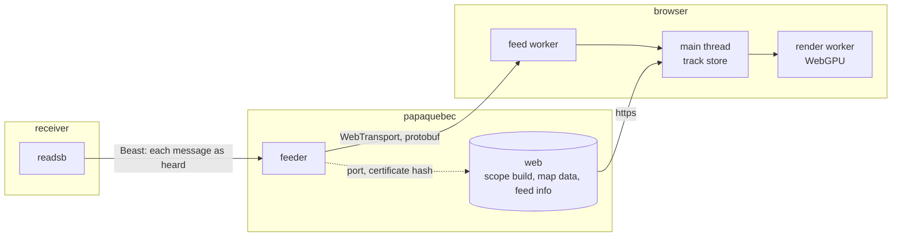

# papaquebec

A passive ADS-B scope in the visual vocabulary of a radar display rather than a map: position
symbols, data blocks and trails on a dark screen. It is served beside a receiver such as
[`readsb`](https://github.com/sdr-enthusiasts/docker-readsb-protobuf): the receiver passes on the
messages it hears, a small server makes out the aircraft they tell of and pushes them to the
browser, and the scope draws.


## Deployment

The scope runs in its own container beside the receiver's: one server that serves the build over
https (browsers expose WebGPU only in secure contexts) and feeds the scope its one source of
traffic.

- It follows the receiver's Beast output, every message as it was heard, and reads the messages
  itself.
- It keeps the last hour of what they add up to and pushes a snapshot every second over
  [WebTransport](https://developer.mozilla.org/docs/Web/API/WebTransport_API).
- Registrations and types come from the
  [Mictronics aircraft database](https://github.com/Mictronics/aircraft-database), which it
  downloads and renews every week.
- At start it generates the map data around the receiver's position.

1. Clone this repository on the machine that runs the receiver.
2. Add the service to the compose file that runs the receiver, then `docker compose up -d --build`:

```yaml
services:
  readsb: # as it is set up already; its Beast output is on port 30005
    image: ghcr.io/sdr-enthusiasts/docker-readsb-protobuf
  papaquebec:
    build: /path/to/papaquebec
    restart: unless-stopped
    environment:
      - PQ_SITE=<lat>,<lon> # where the receiver is
    ports:
      - 443:443
      - 4433:4433/udp # the feed
    volumes:
      - pq_data:/data # the certificate authority and the aircraft database
      - map_data:/app/public/map
    depends_on:
      - readsb
volumes:
  pq_data:
  map_data:
```

3. Open `https://<host>/` on the machine's name (Raspberry Pi OS announces `<hostname>.local`).
   The server signs a certificate for whatever name or address is asked for with its own local
   authority, so the browser objects until that authority is trusted once per device: download
   `https://<host>/root.crt` and add it to the system trust.
   - iOS: Settings > General > VPN & Device Management, then Certificate Trust Settings.
   - macOS: Keychain Access.
   - Elsewhere: `certutil` or `update-ca-certificates`.

Environment on the service:

- `PQ_SITE` (`lat,lon`, required): where the receiver is.
  - Positions are made out around it and the map data is generated around it; nothing a receiver
    sends tells it.
- `PQ_BEAST` (default `readsb:30005`): the receiver's Beast output as `host:port`.
  - For a service named differently, or another decoder in its place, such as dump1090.
- `PQ_FEED_PORT` (default `4433`): the UDP port of the feed.
  - The scope connects to the same number, so publish it unchanged: `4500:4500/udp` with
    `PQ_FEED_PORT=4500`.
  - It cannot be the page's port. Safari sends the page's own requests over a feed connection to
    the same host and port, which answers only the feed, and the page fails to load.
- `PQ_ADDRESS` (default `https://`): how the scope is served.
  - `https://` answers to any name; `https://<host>`, or just `<host>`, keeps the certificates to
    that one.
  - Opening the scope by address needs that address here: a browser does not say which it opened,
    and behind Docker's port mapping the container sees only its own.
  - `http://` serves plain http on port 80 for a setup that terminates TLS itself, such as
    [Tailscale](https://tailscale.com) or a reverse proxy; then publish `80`, not `443`.
  - Each takes a `:<port>` to listen on instead.

Besides:

- Ports can be remapped (`8443:443`) when 443 is taken.
- The feed needs no certificate trusted: the server makes its own for it every week, and the scope
  accepts it by its hash, read over https.
- The feed accepts a session only from a page served by the host it addresses, so another site
  cannot read it through a visitor's browser.
- An update is `git pull` and `up -d --build` again; a restart refreshes the aeronautical data.

## Development

`mise install` pins Bun and Rust, and `mise run` starts the pieces together; `mise tasks` lists
them. The server follows a receiver or flies a synthetic fleet in its place; here it speaks plain
http on port 8080, and the dev server passes the feed's info on to it (`PQ_WEB` names another):

```sh
export PQ_BEAST=<host>:30005 PQ_SITE=<lat>,<lon>
(cd scope && bun run map)   # map data around the receiver, see below
mise run dev                # the scope and its server, on real traffic
mise run sim                # the same on the synthetic fleet; PQ_SITE=lat,lon moves it
mise run check              # everything CI runs
mise run bench              # a load test, see below
mise run bench:blocks       # score the data block placer on the sim's scenarios
```

The sim needs no receiver: it stands in for one, sending the messages its fleet would broadcast
and answer, around RJTT unless `PQ_SITE` says otherwise (with `PQ_SITE` exported, `bun run map`
builds the map around the same site). The server flies it whenever `PQ_SIM` is set to a site.

- `PQ_SIM_SPEED` runs it up to 1000 times faster than the clock.
- `PQ_SIM_EXTRA` adds up to 10000 generic targets.
- `PQ_SIM_SCENARIO` (`merge`, `parallel`, `cross`, `converging` or `random`) flies a traffic
  scenario around RJTT in place of the fleet.

Query parameters:

- `?site=<lat>,<lon>` overrides the receiver position.
- `?wx=<base>` reads METARs from your own [Aviation Weather Center](https://aviationweather.gov)
  proxy.

GitHub Actions runs the same checks and builds the image on every push to `main` and every pull
request. Two headless scripts describe their flags in their headers:

- `bun scripts/screenshot.ts` drives a build in headless Chromium with WebGPU and saves a frame
  plus the console log; with `--sim` it starts a server of its own that flies the sim and serves
  the build. `bun run screenshot` regenerates the README picture that way.
- `mise run bench` is a load test with extra sim traffic, always on a server of its own.

Tests and the synthetic fleet use made-up identities, so nothing names a real aircraft or flight;
the sim's tests enforce this for the fleet.

- Callsigns are `TEST` plus digits; a real airline callsign is three letters then a number.
- Registrations are `TEST-` plus digits.
- Addresses come from `D00000`–`DFFFFF`, a block ICAO Annex 10 Vol III reserves for future use.

## Altimeter

The QNH follows the METAR of the station named on the Display panel (blank means the nearest airport
with a report), re-read periodically and shown in the top bar with the observation time. Typing
a QNH switches to manual until AUTO is turned back on. Reports come from the [Iowa Environmental
Mesonet](https://mesonet.agron.iastate.edu), which relays NOAA's worldwide METAR feed with browser
access allowed; NOAA's own Aviation Weather Center does not, hence the `?wx=` proxy option.

## Map data

`bun run map` (the container runs it at every start) writes two git-ignored files:

- `public/map/coast.json`: [Natural Earth](https://www.naturalearthdata.com) 10 m coastline (public
  domain) within 300 NM of the site; skipped while the file already covers the same site.
- `public/map/aero.json`: airspace, navaids, airports and reporting points within 150 NM from
  [openAIP](https://www.openaip.net)'s daily exports (anonymous download, CC BY-NC-SA 4.0), for
  every country in range, titled with the fetch date. When the exports cannot be reached the
  previous file is kept.

The site comes from `PQ_SITE` (`lat,lon`); pass `<lat> <lon>` and optionally a radius to either
script to override it.

openAIP carries no IFR waypoints or airways, so those layers stay empty. Any other source can be
brought in through the Maps panel.

- `IMPORT JSON…` takes a file in the `aero.json` format, checked against `/aero.schema.json`
  (served by the scope, generated from the code) before it is accepted.
- Each set lists under `SOURCES` by its title and can be toggled or removed; the openAIP set
  generated at start is the one that stays.
- Imported sets live in the browser's storage, so they are per device.

## Design

- **Instrument, not map.** Optimized for "what is that aircraft doing", not "where is that in the
  world". No basemaps, raster imagery, clustering, themes or eased camera motion.
- **Honesty over polish.** Stale looks stale, missing is shown as missing, a dead feed says so.
  Nothing is interpolated or smoothed; the raw report is the track. The only extrapolations are the
  velocity vector and the RBL closure readout, both drawn as what they are. No conflict alerting.
- **Stillness is the default.** Nothing reported animates, pulses, blinks or fades. A trail mark
  stays where it was drawn until it ages out. The one exception is a data block changing bearing,
  which slides there so the eye can follow it.

Conventions:

- **Color** is climb state: cyan up, amber down, green level. Stale is gray, emergency red,
  selected white.
- **Shape** is source: ADS-B filled square, MLAT square with ring, TIS-B diamond. Filtered-out
  targets persist as bare hollow diamonds.
- **Emergency** is additive: red plus a two-letter tag (`HJ` `RF` `EM`), never hidden by filters.
  - An active resolution advisory tags the block `RA` in the same red, and an ident `ID` in the
    block's own tone; the tags share one line in that order.
  - The detail panel badges them beside the callsign, the advisory in the words TCAS says it in.
- **Data blocks** put the callsign over the altitude with climb arrow and, flipping every eight
  seconds in step across all blocks, the type or ground speed with wake letter.
  - Each hangs on a short leader at one of eight bearings round its target, reading away from the
    leader.
  - It can be dragged to another bearing, which it keeps unless it must give way.
- **Downlinked intent** is set in a dimmed tone of the block's color.
  - The selected altitude follows the altitude (`240↑350`), or a `✓` replaces the arrow while the
    aircraft holds it within 200 ft on its own altimeter.
  - A selected heading (`270°`) adds a third line while it steers the aircraft, not LNAV or an
    approach.
- **Trails** are slashes decimated to eight-second slots.
- **Bearings** shown to the operator are magnetic, 001 to 360, each by the declination where it is
  measured: a track where the aircraft is, a cursor or an RBL at its origin.
- **The top bar** carries only runtime state.
- **The `i`** beside the panel buttons opens the credits: whose data the scope shows, and on which
  terms.

Layout:

- **Desktop**: the panels dock in two columns beside the scope, Display and Maps on the left,
  Aircraft and Detail on the right, toggled from the top bar.
- **Phone** (below 720 px): the columns become one bottom sheet with a tab bar, and the top bar
  keeps clock, QNH and feed state.
- **Touch**: one finger pans, two pinch-zoom around the fingers, a tap selects, a long press opens
  the menu, a drag off a target draws an RBL.
- **Mouse and keyboard**: hover, right-drag range cursor, drag off a target for an RBL, wheel zoom
  and the shortcuts `?` lists.

## Architecture


```mermaid
flowchart LR
    subgraph c["receiver"]
        readsb
    end
    subgraph p["papaquebec"]
        web[("web<br/>scope build, map data, feed info")]
        feeder
    end
    subgraph b["browser"]
        feed[feed worker] --> store[main thread<br/>track store] --> render[render worker<br/>WebGPU]
    end
    web -- https --> store
    readsb -- "Beast: each message as heard" --> feeder -- "WebTransport, protobuf" --> feed
    feeder -. "port, certificate hash" .-> web
```

**Data.** The receiver passes on every Mode S message it hears, in the Beast format. The feeder
reads what each says (`message`, by ICAO Annex 10 Volume IV) and keeps what is said of each
aircraft until it lapses (`traffic`).

- Extended squitters, which is ADS-B: their fields by RTCA DO-260B (`field`), with the positions
  that place the aircraft (`cpr`).
- Replies to radars: the altitude, the identity and the ident in every one, and in Comm-B replies
  the registers the ground asks for (`register`, by ICAO Doc 9871): the callsign, the selected
  altitudes and QNH, track and ground speed, heading, airspeeds and Mach, and an active resolution
  advisory.
  - A reply does not name its register, so each is told apart by the layout it fits and by what
    the aircraft broadcasts.
  - A broadcast value wins over an answered one while it is current.
- Derived from them: the wind, with the magnetic heading made true by the World Magnetic Model
  (`wmm`), and the air temperature (`air`).
- Added from the aircraft database: the registration and type (`registry`).
- Not read yet: what the ground rebroadcasts (TIS-B, ADS-R).

Every second the feeder publishes a snapshot as protobuf (`proto/papaquebec/feed/v1/feed.proto`,
named after DO-260B), which the feed worker reads into what the scope knows of an aircraft
(`lib/aircraft.ts`), every field optional.

- Each session is one ordered stream: a hello with the receiver's position and the history since
  the snapshot the scope last took (one every eight seconds, up to an hour), then live snapshots.
- The history is kept in memory from when the server starts, so a session after a lost connection
  or a sleeping phone fills the trails' gap by itself; a restart of the server starts the trails
  anew.
- Every wait on a session has a deadline, and a missed one only means connecting again; the top
  bar tells the feed's state from the age of its data.
- Each snapshot is a full one and the track store is rebuilt from it; liveness is the age of an
  aircraft's last message, `seen`. Only position history and operator state (selection, block
  bearing) persist across snapshots.
- Live `lat/lon` draws normally, `lastPosition` draws stale, absent positions appear only in text.

**Rendering.** WebGPU on an `OffscreenCanvas` in a worker (main-thread fallback when the worker has
no adapter). The main thread owns all state and sends packed buffers; one draw per layer per frame,
drawn only when something changed. Projection is Lambert Conformal Conic on WGS-84 centered on the site;
positions are projected at ingest. Text is an SDF glyph atlas
built at runtime from [JetBrains Mono](https://www.jetbrains.com/lp/mono/).

**Layout.** `scope/src/` is split by role: pure library, shared state, feed, renderer, canvas input,
panels and UI, design tokens. The rules: `state/` is the only shared state, `lib/` imports no
framework, worker code never imports Solid or touches the DOM, and components are styled only
through the design tokens. `scripts/` holds the data tools and the headless browser scripts.
`proto/` holds the schema both sides generate their types from. `crates/` holds the server's Rust
crates:

- `web/`: the server, the `papaquebec` binary. It reads the environment (`config`), answers for
  the scope's files and the feed's info (`site`) at a door that speaks https or plain http
  (`door`), and runs the feed.
- `authority/`: the local certificate authority behind the door.
- `feeder/`: the feed as a library.
  - The Beast format (`beast`); Mode S messages (`message`) with the fields of their extended
    squitters (`field`) and the Comm-B registers (`register`), over `bits`, and the positions in
    them (`cpr`), each read and written in one place.
  - The aircraft they tell of (`traffic`), with the standard atmosphere (`air`) they are read by,
    and the aircraft database (`registry`).
  - The following of a receiver (`follow`), what every session is served from (`feed`), the wire
    contract (`proto`) and the WebTransport endpoint (`transport`).
- `sim/`: a receiver stood in for: a synthetic fleet, sent as the messages it would broadcast and
  answer, written with the same fields.
- `placer/`: places the data blocks, annealing over the cost of every bearing each could take; the
  scope runs it as WebAssembly in a worker, the benchmark natively on the sim's scenarios.
- `wmm/`: the World Magnetic Model, WMM2025. The feeder reads it to make headings true; the scope
  runs it as WebAssembly to make bearings magnetic where each is measured.

**Stack.**

- **Scope**
  - TypeScript (strict), [Solid](https://www.solidjs.com) and [Vite](https://vite.dev)
  - raw [WebGPU](https://www.w3.org/TR/webgpu/)
  - the data block placer in Rust, as WebAssembly through
    [wasm-bindgen](https://github.com/wasm-bindgen/wasm-bindgen)
  - [protobuf-es](https://github.com/bufbuild/protobuf-es) for the feed, its types generated by
    [buf](https://buf.build)
  - [oxlint and oxfmt](https://oxc.rs)
- **Server**
  - Rust on [tokio](https://tokio.rs)
  - [axum](https://github.com/tokio-rs/axum) and [hyper](https://hyper.rs) over
    [rustls](https://github.com/rustls/rustls), with certificates made by
    [rcgen](https://github.com/rustls/rcgen)
  - [wtransport](https://github.com/BiagioFesta/wtransport) for WebTransport and
    [prost](https://github.com/tokio-rs/prost) for protobuf
  - clippy and rustfmt
- **Toolchains**: [Bun](https://bun.sh) and Rust with its wasm32 target and wasm-bindgen-cli, pinned
  by [`mise`](https://mise.jdx.dev)

## License

The code is MIT licensed. The generated aeronautical data is openAIP's, [CC BY-NC-SA
4.0](https://creativecommons.org/licenses/by-nc-sa/4.0/): it may not be used commercially, and a
copy of `aero.json` passed on keeps that license. Registrations and types are from the [Mictronics
aircraft database](https://github.com/Mictronics/aircraft-database), made available under the [Open
Data Commons Attribution License](https://opendatacommons.org/licenses/by/1-0/); the server
downloads it, and none of it is in this repository. The coastline is public domain and JetBrains
Mono is under the [SIL Open Font License](https://openfontlicense.org), shipped in `public/fonts`.
