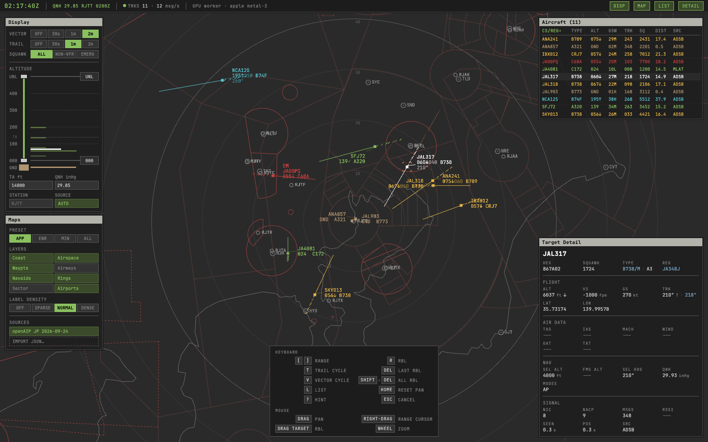
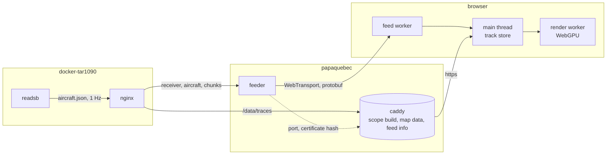

# papaquebec

A passive ADS-B scope in the visual vocabulary of a radar display rather than a map: position
symbols, data blocks and trails on a dark screen. It is served beside
[`docker-tar1090`](https://github.com/sdr-enthusiasts/docker-tar1090) in place of its web UI:
[`readsb`](https://github.com/wiedehopf/readsb) decodes, a small feeder pushes what it hears to the
browser, and the scope draws.



## Deployment

The scope runs in its own container beside `docker-tar1090`: a [Caddy](https://caddyserver.com) that
serves the build over https (browsers expose WebGPU only in secure contexts, which the tar1090 image
cannot provide) and proxies the selected aircraft's day trace to
[tar1090](https://github.com/wiedehopf/tar1090), which stays stock on port 80. Beside it runs the
feeder, the scope's one source of traffic: it follows tar1090's `aircraft.json`, keeps the last
hour of it, starting from tar1090's own history, and pushes each new snapshot over
[WebTransport](https://developer.mozilla.org/docs/Web/API/WebTransport_API). At start the container
asks tar1090 for the receiver position and generates the map data around it, so nothing needs
configuring beyond the compose entry.

1. Clone this repository on the machine that runs tar1090.
2. Add the service to the compose file that runs tar1090, then `docker compose up -d --build`:

```yaml
services:
  tar1090:
    environment:
      - TAR1090_ENABLE_AC_DB=true # type and registration in aircraft.json
  papaquebec:
    build: /path/to/papaquebec
    restart: unless-stopped
    ports:
      - 443:443
      - 443:443/udp # HTTP/3
      - 4433:4433/udp # the feed
    volumes:
      - caddy_data:/data # the certificate authority
      - map_data:/app/public/map
    depends_on:
      - tar1090
volumes:
  caddy_data:
  map_data:
```

3. Open `https://<host>/` on the machine's name (Raspberry Pi OS announces `<hostname>.local`).
   Caddy signs a certificate for whatever name is asked for with its own local authority, so the
   browser objects until that authority is trusted once per device: download `https://<host>/root.crt`
   and add it to the system trust (Settings > General > VPN & Device Management, then Certificate
   Trust Settings on iOS; Keychain Access on macOS; `certutil`/`update-ca-certificates` elsewhere).

Environment on the service, all optional:

- `PQ_TAR1090` (default `http://tar1090`): the tar1090 service, if it is named differently.
- `PQ_SITE` (`lat,lon`): the center of the generated map data, when readsb is not told its
  position; the scope itself then needs `?site=` (see Development).
- `PQ_FEED_PORT` (default `4433`): the UDP port of the feed. The scope connects to the same
  number, so publish it unchanged (`4500:4500/udp` with `PQ_FEED_PORT=4500`).
- `PQ_ADDRESS` (default `https://`): the Caddy site address. A host name or IP pins the certificate
  to it; `http://` serves plain http on port 80 for a setup that terminates TLS itself, such as
  [Tailscale](https://tailscale.com) or an existing reverse proxy (then publish `80`, not `443`).

Ports can be remapped (`8443:443`) when 443 is taken. The feed needs no certificate trusted: the
feeder makes its own every week and the scope accepts it by its hash, read over https. The feeder
accepts a session only from a page served by the host it addresses, so another site cannot read it
through a visitor's browser. An update is `git pull` and `up -d --build` again; a restart refreshes
the aeronautical data. Optionally, `READSB_ENABLE_TRACES=true` on tar1090 with a
`/var/globe_history` volume lets the selected target show its whole day instead of the last hour.

## Development

`mise install` pins Bun and Rust, and `mise run` starts the pieces together; `mise tasks` lists
them. The feeder follows a tar1090 or flies a synthetic fleet in its place, and the dev server
proxies traces to the same tar1090:

```sh
export PQ_TAR1090=http://<host>
(cd scope && bun run map)   # map data around the receiver, see below
mise run dev                # the scope and the feeder, on real traffic
mise run sim                # the same on the synthetic fleet; PQ_SITE=lat,lon moves it
mise run check              # everything CI runs
mise run bench              # a load test, see below
```

The sim needs no tar1090: the feeder tells the scope the site it flies around, RJTT unless `PQ_SITE`
says otherwise (with `PQ_SITE` exported, `bun run map` builds the map around the same site). The
feeder flies it whenever `PQ_SIM` is set to a site; `PQ_SIM_SPEED` runs it up to 1000 times faster
than the clock and `PQ_SIM_EXTRA` adds generic targets.

Query parameters: `?site=<lat>,<lon>` overrides the receiver position, `?wx=<base>` reads METARs
from your own [Aviation Weather Center](https://aviationweather.gov) proxy.

GitHub Actions runs the same checks and builds the image on every push to `main` and every pull
request. `bun scripts/screenshot.ts` drives a build in headless Chromium with WebGPU and saves a
frame plus the console log; with `--sim` it starts a feeder of its own flying the sim, as `mise run
bench`, a load test with extra sim traffic, always does. `bun run screenshot` regenerates the README
picture that way. Both describe their flags in their headers.

Tests and the synthetic fleet use made-up identities, so nothing names a real aircraft or flight:
callsigns are `TEST` plus digits (a real airline callsign is three letters then a number), registrations
`TEST-` plus digits, and addresses come from `D00000`–`DFFFFF`, a block ICAO Annex 10 Vol III reserves
for future use. The sim's tests enforce this for the fleet.

## Altimeter

The QNH follows the METAR of the station named on the Display panel (blank means the nearest airport
with a report), re-read periodically and shown in the top bar with the observation time. Typing
a QNH switches to manual until AUTO is turned back on. Reports come from the [Iowa Environmental
Mesonet](https://mesonet.agron.iastate.edu), which relays NOAA's worldwide METAR feed with browser
access allowed; NOAA's own Aviation Weather Center does not, hence the `?wx=` proxy option.

## Map data

`bun run map` (the container runs it at every start) writes two git-ignored files:

- `public/map/coast.json`: [Natural Earth](https://www.naturalearthdata.com) 10 m coastline (public
  domain) within 300 NM of the site; skipped while the file already covers the same site.
- `public/map/aero.json`: airspace, navaids, airports and reporting points within 150 NM from
  [openAIP](https://www.openaip.net)'s daily exports (anonymous download, CC BY-NC-SA 4.0), for
  every country in range, titled with the fetch date. When the exports cannot be reached the
  previous file is kept.

The site comes from `PQ_SITE` (`lat,lon`) or the tar1090 at `PQ_TAR1090`; pass `<lat> <lon>` and
optionally a radius to either script to override it.

openAIP carries no IFR waypoints or airways, so those layers stay empty. Any other source can be
brought in through the Maps panel: `IMPORT JSON…` takes a file in the `aero.json` format, checked
against `/aero.schema.json` (served by the scope, generated from the code) before it is accepted.
Each set lists under `SOURCES` by its title and can be toggled or removed; the openAIP
set generated at start is the one that stays. Imported sets live in the browser's storage, so they
are per device.

## Design

- **Instrument, not map.** Optimized for "what is that aircraft doing", not "where is that in the
  world". No basemaps, raster imagery, clustering, themes or eased camera motion.
- **Honesty over polish.** Stale looks stale, missing is shown as missing, a dead feed says so.
  Nothing is interpolated or smoothed; the raw report is the track. The only extrapolations are the
  velocity vector and the RBL closure readout, both drawn as what they are. No conflict alerting.
- **Stillness is the default.** Nothing animates, pulses, blinks or fades. A trail mark stays where
  it was drawn until it ages out.

Conventions:

- **Color** is climb state: cyan up, amber down, green level. Stale is gray, emergency red,
  selected white.
- **Shape** is source: ADS-B filled square, MLAT square with ring, TIS-B diamond. Filtered-out
  targets persist as bare hollow diamonds.
- **Emergency** is additive: red plus a two-letter prefix (`HJ` `RF` `EM`), never hidden by filters.
- **Data blocks** are two lines: callsign; then altitude with climb arrow and, flipping every eight
  seconds in step across all blocks, type or ground speed with wake letter. Each sits in the first
  free of four corners and is left alone until it collides; dragging one pins it.
- **Downlinked intent** is set in a dimmed tone of the block's color: the selected altitude
  follows the altitude (`240↑350`), or a `✓` replaces the arrow while the aircraft holds it within
  200 ft on its own altimeter, and a selected heading (`270°`) adds a third line while it steers the
  aircraft, not LNAV or an approach.
- **Trails** are slashes decimated to eight-second slots.
- **Bearings** shown to the operator are magnetic, 001 to 360.
- **The top bar** carries only runtime state.

Layout:

- **Desktop**: the panels dock in two columns beside the scope, Display and Maps on the left,
  Aircraft and Detail on the right, toggled from the top bar.
- **Phone** (below 720 px): the columns become one bottom sheet with a tab bar, and the top bar
  keeps clock, QNH and feed state.
- **Touch**: one finger pans, two pinch-zoom around the fingers, a tap selects, a long press opens
  the menu, a drag off a target draws an RBL.
- **Mouse and keyboard**: hover, right-drag range cursor, drag off a target for an RBL, wheel zoom
  and the shortcuts `?` lists.

## Architecture


```mermaid
flowchart LR
    subgraph c["docker-tar1090"]
        readsb -- "aircraft.json, 1 Hz" --> nginx
    end
    subgraph p["papaquebec"]
        caddy[("caddy<br/>scope build, map data, feed info")]
        feeder
    end
    subgraph b["browser"]
        feed[feed worker] --> store[main thread<br/>track store] --> render[render worker<br/>WebGPU]
    end
    nginx -- "/data/traces" --> caddy -- https --> store
    nginx -- "receiver, aircraft, chunks" --> feeder -- "WebTransport, protobuf" --> feed
    feeder -. "port, certificate hash" .-> caddy
```

**Data.** The contract is `readsb`'s `aircraft.json`
([`README-json.md`](https://github.com/wiedehopf/readsb/blob/dev/README-json.md)); `lib/` types the
subset read, every field optional. The feeder carries the same snapshot as protobuf
(`proto/papaquebec/feed/v1/feed.proto`, named after RTCA DO-260B), which the feed worker reads back
into that contract. Each session is one ordered stream: a hello with the receiver's position and the
history since the snapshot the scope last took (one every eight seconds, up to an hour), then live
snapshots. The feeder seeds that history from tar1090's own (`/chunks/`) when it starts, so a
session after a restart, a lost connection or a sleeping phone fills the trails' gap by itself.
Every wait on a session has a deadline, and a missed one only means connecting again; the top bar
tells the feed's state from the age of its data.

Each snapshot is a full one and the track store is rebuilt from it; liveness is `readsb`'s `seen`.
Only position history and operator state (selection, pinned corner, hidden trail) persist across
snapshots. Selecting a target fetches its readsb day trace (`/data/traces/`) when the container
keeps them. Live `lat/lon` draws normally, `lastPosition` draws stale, rough or absent positions
appear only in text.

**Rendering.** WebGPU on an `OffscreenCanvas` in a worker (main-thread fallback when the worker has
no adapter). The main thread owns all state and sends packed buffers; one draw per layer per frame,
drawn only when something changed. Projection is Lambert Conformal Conic on WGS-84 centered on the site;
positions are projected at ingest. Text is an SDF glyph atlas
built at runtime from [JetBrains Mono](https://www.jetbrains.com/lp/mono/).

**Layout.** `scope/src/` is split by role: pure library, shared state, feed, renderer, canvas input,
panels and UI, design tokens. The rules: `state/` is the only shared state, `lib/` imports no
framework, worker code never imports Solid or touches the DOM, and components are styled only
through the design tokens. `scripts/` holds the data tools and the headless browser scripts.
`feeder/src/` has the wire contract (`proto`), readsb's JSON (`readsb`), what every session is
served from (`feed`), the traffic sources behind one `Upstream` trait (`upstream/`: tar1090 and the
sim), the WebTransport endpoint (`transport`) and the environment (`config`); `proto/` holds the
schema both sides generate their types from.

**Stack.**

- **Scope**
  - TypeScript (strict), [Solid](https://www.solidjs.com) and [Vite](https://vite.dev)
  - raw [WebGPU](https://www.w3.org/TR/webgpu/)
  - [protobuf-es](https://github.com/bufbuild/protobuf-es) for the feed, its types generated by
    [buf](https://buf.build)
  - [oxlint and oxfmt](https://oxc.rs)
- **Feeder**
  - Rust on [tokio](https://tokio.rs)
  - [wtransport](https://github.com/BiagioFesta/wtransport) for WebTransport and
    [prost](https://github.com/tokio-rs/prost) for protobuf
  - clippy and rustfmt
- **Toolchains**: [Bun](https://bun.sh) and Rust, pinned by [`mise`](https://mise.jdx.dev)

## License

The code is MIT licensed. The generated aeronautical data is openAIP's, [CC BY-NC-SA
4.0](https://creativecommons.org/licenses/by-nc-sa/4.0/): it may not be used commercially, and a
copy of `aero.json` passed on keeps that license. The coastline is public domain and JetBrains Mono
is under the [SIL Open Font License](https://openfontlicense.org), shipped in `public/fonts`.
